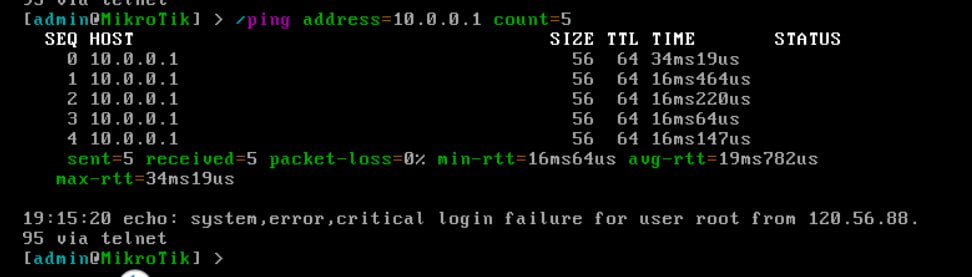
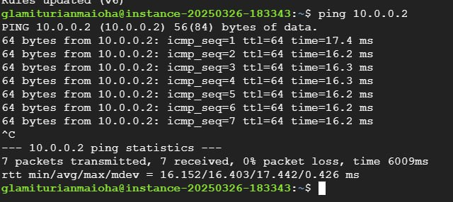

University: [ITMO University](https://itmo.ru/ru/)

Faculty: [FICT](https://fict.itmo.ru)

Course: [Network programming](https://github.com/itmo-ict-faculty/network-programming)

Year: 2024/2025

Group: K3320

Author: Kolomiets Alice Denisovna

Lab: Lab1

Date of create: 23.03.2025

Date of finished: 26.03.2025

# Отчёт по лабораторной работе №1 "Установка CHR и Ansible, настройка VPN"

***Цель:*** развернуть виртуальную машину на базе платформы Microsoft Azure с установленной системой контроля конфигураций Ansible и установить CHR в VirtualBox


## Ход работы


Первым шагом был подготовлен CHR сервер - для этого использовалось облако Selectel. (В прошлом семестре я использовала вторую ОС убунту, сейчас попробовала этот способ - ощущается проще и быстрее)


Также CHR необходимо было правильно подготовить для дальнейшей настройки, установить нужную версию (для WireGuard). В ходе работы использовалась консоль 


Далее для подготовки сервера автоматизации использовался GCP, а в нем базовый сервер на Ubuntu (характеристики применялись максимально низкие для экономии ресурса) 


В ходе процесса настройки сервера автоматизации были выполнены следующие действия: обновление списка пакетов и системы, установка WireGuard
Также были сгенерированы ключи для WireGuard - приватный и публичный (привытный ключ не должен открыто распространятся, он используется для расшифровки трафика, публичный ключ можно передавать другим участникам VPN для установки безопасного соединения)
Выполняем на сервере автоматизации: 


После этого был определен конфиг WireGuard'a:

```
[Interface]
PrivateKey = <приватный ключ, полученный выше>
Address = 10.0.0.1/24
ListenPort 
PostUp = iptables -A FORWARD -i wg0 -j ACCEPT; iptables -t nat -A POSTROUTING -o eth0 -j MASQUERADE
PostDown = iptables -D FORWARD -i wg0 -j ACCEPT; iptables -t nat -D POSTROUTING -o eth0 -j MASQUERADE

[Peer]
PublicKey = <публичный ключик CHR роутера>
AllowedIPs = 10.0.0.2/32
```
Далее нужно было пробросить трафик между интерфейсами (sudo sysctl -w net.ipv4.ip_forward=1
) и разрешить входящие UDP-подключения на порт через фаервол ufw и наконец запустить сервис WireGuard


В ходе процесса настройки интерфейсов на роутера нужно было 


После этого оставалось только настроить интерфейсы на роуте: 
добаивить интерфейс WireGuard
```
/interface wireguard add name=wg0  
```
и назначить ему ip алрес
```
/ip address add address=10.0.0.2/24 interface=wg0 
```
после этого добавить peer
```
/interface wireguard peers add interface=wg0 public-key="<публичный ключ сервера автоматизации>" endpoint-address=<IP сервера автоматизации> endpoint-port allowed-address=10.0.0.0/24                                     
```
и настроить фаервол
```

/ip firewall filter add chain=input protocol=icmp action=accept
/ip firewall filter add chain=input protocol=udp dst-port action=accept    
```

## Итог


Проверим работоспособность и то что все правильно настроено: 


В одну сторону



В обратную: 



