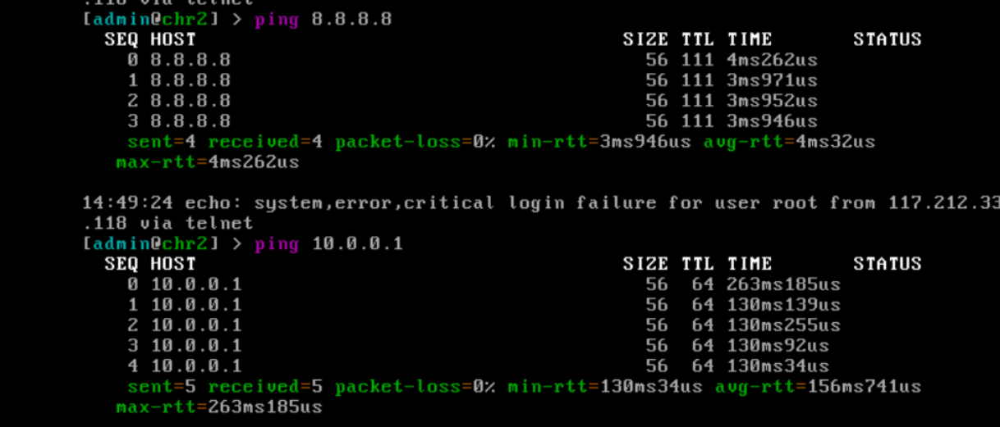
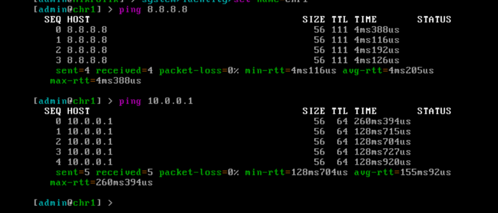
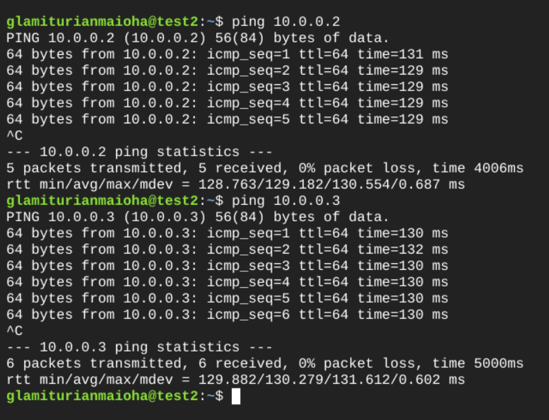
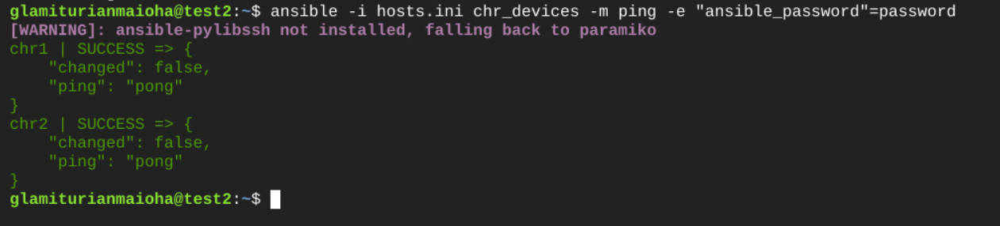
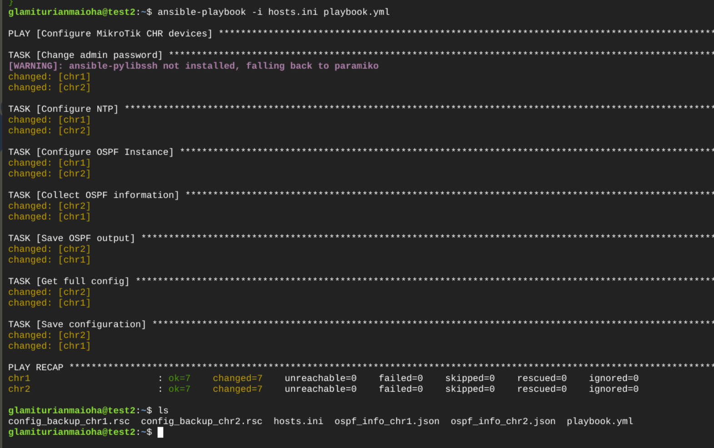
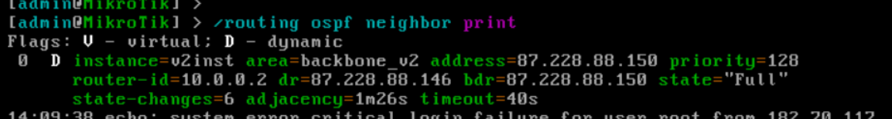
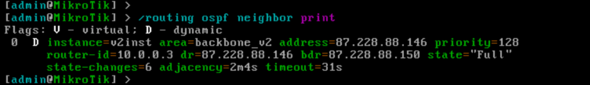
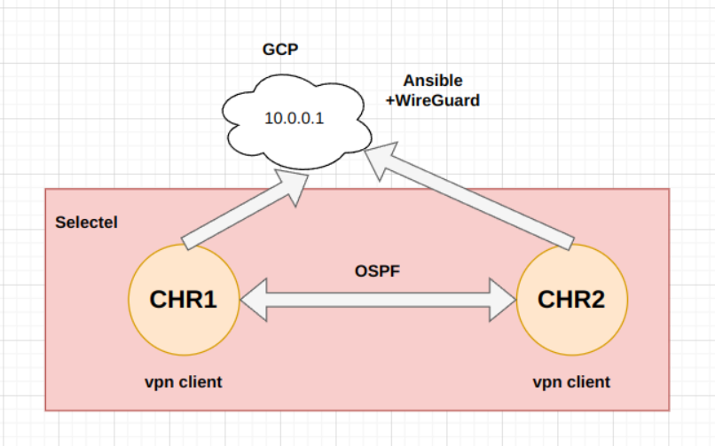

University: [ITMO University](https://itmo.ru/ru/)

Faculty: [FICT](https://fict.itmo.ru)

Course: [Network programming](https://github.com/itmo-ict-faculty/network-programming)

Year: 2024/2025

Group: K3320

Author: Kolomiets Alice Denisovna

Lab: Lab2

Date of create: 20.05.2025

Date of finished: 10.06.2025

# Отчёт по лабораторной работе №2 "Развертывание дополнительного CHR, первый сценарий Ansible"

***Цель:*** С помощью Ansible настроить несколько сетевых устройств и собрать информацию о них. Правильно собрать файл Inventory.

## Ход работы

### Создание и настройка устройств 

По аналогии с лабораторной работы 1, нужно создать один сервер автоматизации (GCP) и два CHR'a (в Selectel)
Нужно удостовериться что все работает корректно: 






### Инвентарь

Далее нужно сделать файл инвентаря:
```
sudo nano hosts.ini
```

Содержимое файла:

```
[chr_devices]
chr1 ansible_host=10.0.0.2 router_id=10.0.0.2
chr2 ansible_host=10.0.0.3 router_id=10.0.0.3

[chr_devices:vars]
ansible_network_os=routeros
ansible_connection=ansible.netcommon.network_cli
ansible_user=admin
```

Нужно проверить что это работает - запустим пинг:



### Playbook

Теперь нужно собрать Playbook:

```
sudo nano playbook.yml
```

```
---
- name: Configure MikroTik CHR devices
  hosts: chr_devices
  gather_facts: false
  connection: community.routeros.api
  vars:
    ntp_primary: "pool.ntp.org"
    ospf_area: "backbone"
    ospf_network: "10.0.0.0/24"
    current_password: "12341234"
    new_password: "12341234"

  tasks:
    - name: Change admin password
      community.routeros.command:
        commands:
          - "/user set admin password={{ new_password }}"
      vars:
        ansible_password: "{{ current_password }}"
      no_log: false

    - name: Configure NTP
      community.routeros.command:
        commands:
          - "/system ntp client set enabled=yes primary-ntp={{ ntp_primary }}"
      vars:
        ansible_password: "{{ new_password }}"

    - name: Configure OSPF Instance
      community.routeros.command:
        commands:
          - "/routing ospf instance set [ find default=yes ] router-id={{ router_id }}"
          - "/interface bridge add name=lo"
          - "/ip address add address={{ router_id }}/32 interface=lo"
          - "/routing ospf instance add name=v2inst version=2 router-id={{ router_id }}"
          - "/routing ospf area add name=backbone_v2 area-id=0.0.0.0 instance=v2inst"
          - "/routing ospf interface-template add network=0.0.0.0/0 area=backbone_v2"

      vars:
        ansible_password: "{{ new_password }}"

    - name: Collect OSPF information
      community.routeros.command:
        commands:
          - "/routing ospf neighbor print"
          - "/routing ospf instance print"
          - "/routing ospf interface print"
      vars:
        ansible_password: "{{ new_password }}"
      register: ospf_data

    - name: Save OSPF output
      ansible.builtin.copy:
        content: "{{ ospf_data.stdout | to_nice_json }}"
        dest: "./ospf_info_{{ inventory_hostname }}.json"

    - name: Get full config
      community.routeros.command:
        commands:
          - "/export"
      vars:
        ansible_password: "{{ new_password }}"
      register: full_config

    - name: Save configuration
      ansible.builtin.copy:
        content: "{{ full_config.stdout }}"
        dest: "./config_backup_{{ inventory_hostname }}.rsc"
```


Проверим работает ли это правильно:

(оно заработало не сразу.. но заработало!)



Результат работы Playbook, в частоности ospf





### Схема


