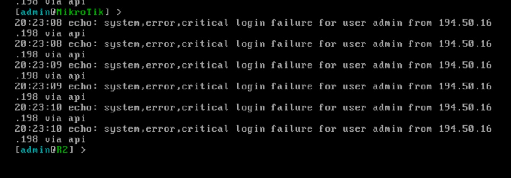

University: [ITMO University](https://itmo.ru/ru/)

Faculty: [FICT](https://fict.itmo.ru)

Course: [Network programming](https://github.com/itmo-ict-faculty/network-programming)

Year: 2024/2025

Group: K3320

Author: Kolomiets Alice Denisovna
Lab: Lab3

Date of create: 20.05.2025

Date of finished: 07.06.2025

# Отчёт по лабораторной работе №3 "Развертывание Netbox, сеть связи как источник правды в системе технического учета Netbox"

***Цель:*** С помощью Ansible и Netbox собрать всю возможную информацию об устройствах и сохранить их в отдельном файле.

## Ход работы

### Создание и настройка устройств 

Сначала нужно повторить действия из двух первых лабораторных работ - создать 2 CHR, один сервер автоматизации.
Также, в ходе этой лабораторной работе нужно будет создать еще один сервер, на котором будет запущен NetBox. 

Сначала проверим что все работает корректно - по аналогии с первыми двумя лабораторными работами 

### Разворачивание NetBox
Теперь нужно содать еще одну виртуальную машину и по гайду развернуть NetBox
сначала установим пароль для супер юзера и зайдем по локалхосту в GUI

Подключенные устройства - (нужно заполнить информацию о наших CHR) (честно не могу сказать что супер интуитивный интерфейс) 

### Задание 1 - Сохранение информации о девайсах 
Сначала нужно создать playbook 

выведем json с информацией 

Выведем в [json](./assets/devices.json)

### Задание 2 - Переименование девайсов 

Создадим playbook и запустим

Можно увидеть что девайсы изменили названия 

### Задание 3 - Сбор серийных номеров устройств

Создадим playbook и запустим

Результаты: 

### Схема

