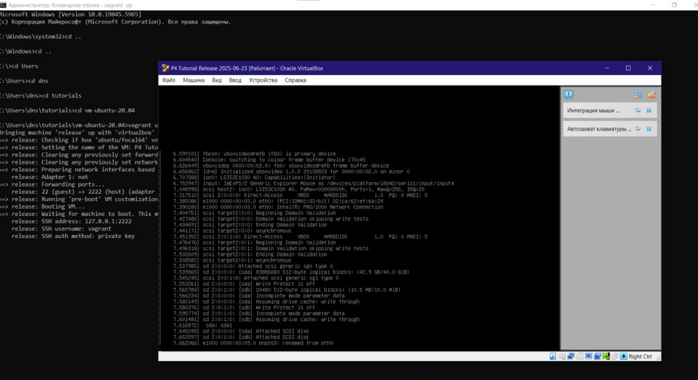
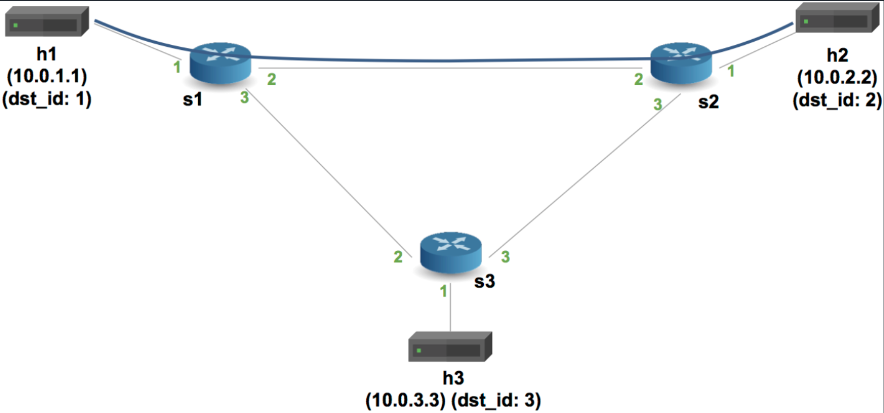
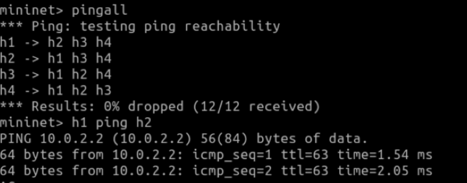
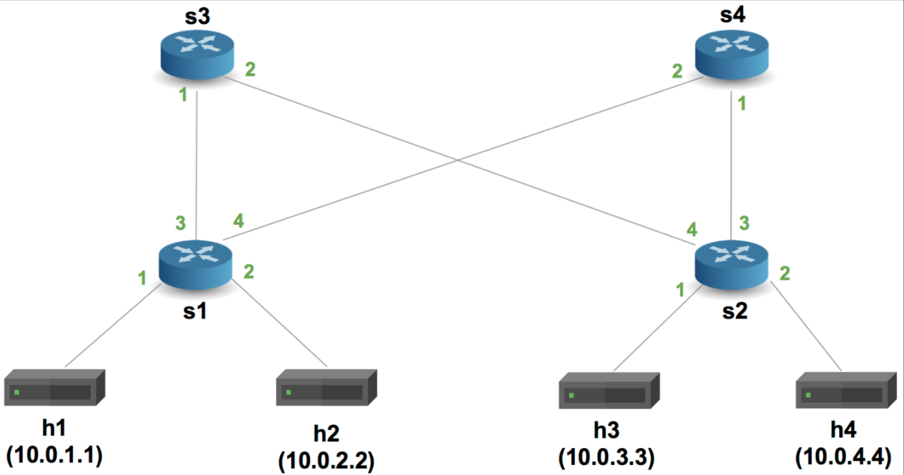
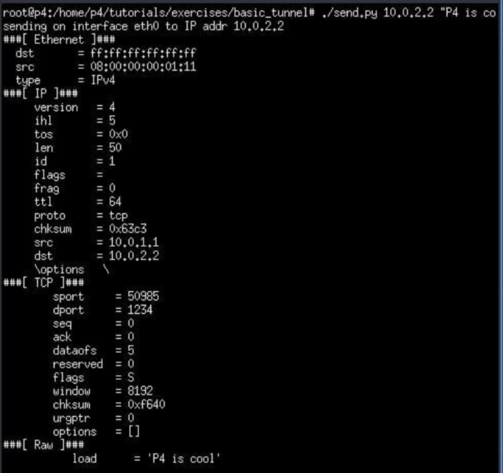
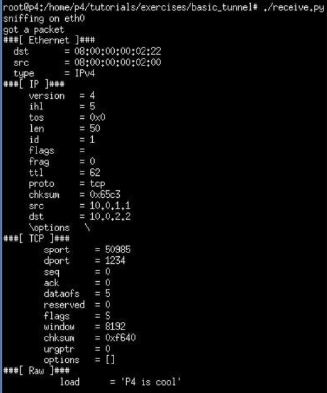
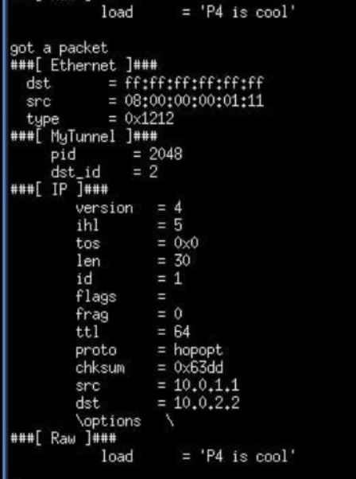
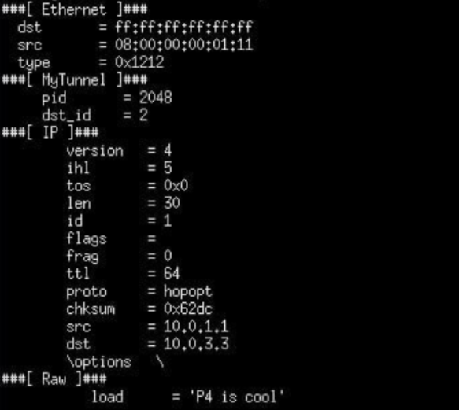
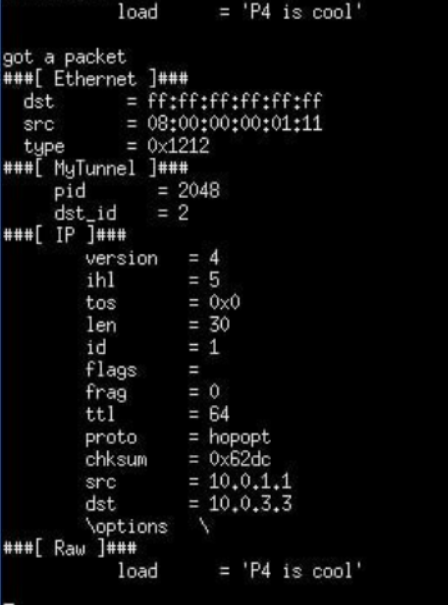

University: [ITMO University](https://itmo.ru/ru/)

Faculty: [FICT](https://fict.itmo.ru)

Course: [Network programming](https://github.com/itmo-ict-faculty/network-programming)

Year: 2024/2025

Group: K3320

Author: Kolomiets Alice Denisovna

Lab: Lab4

Date of create: 08.06.2025

Date of finished: 10.06.2025

# Отчёт по лабораторной работе №4 "Базовая 'коммутация' и туннелирование используя язык программирования P4"

***Цель:*** Изучить синтаксис языка программирования P4 и выполнить 2 задания обучающих задания от Open network foundation для ознакомления на практике с P4.

## Ход работы

### Подготовка среды 

Сначала нужно было установить vagrant и VirtualBox. Не все прошло гладко, но в итоге все поставилось
Установим vagrant и VirtualBox

По заданию нужно склонировать репозиторий [p4lang/tutorials](https://github.com/p4lang/tutorials), и поднять через vagrant ВМ на Ubuntu20.04 

После долгой загрузки (и иногда страданий потому что заработало оно не сразу) Виртуальная машина запустилась с двумя аккаунтами - p4 и vagrant

### Implementing Basic Forwarding

В лабораторной работе представлены материалы на которые будем ориентироваться [basic.p4](https://github.com/p4lang/tutorials/blob/master/exercises/basic/basic.p4).

Основные топики: 
- header: описывает заголовки 
- parser: извлекает нужные поля из пакетов 
- ingress: содержит таблицу ipv4, где происходит match по hdr.ipv4.dstAddr
- actions: ipv4_forward (или drop пакета)
- deparser: сбор пакета обратно

Создадим файл 
[basic.p4](./assets/basic.p4)

В начале программа определяет заголовки Ethernet и IPv4, которые извлекаются из входящего пакета парсером. В блоке управления MyIngress осуществляется поиск IP назначения в таблице ipv4_lpm с помощью алгоритма наилучшего совпадения по префиксу. В зависимости от найденного правила выполняется действие ipv4_forward, в котором подменяется MAC-адрес назначения и указывается порт, на который следует отправить пакет. Если подходящего правила не найдено, срабатывает действие по умолчанию drop, и пакет отбрасывается.

При запуске:

### Implementing Basic Tunneling

Создадим файл 
[basic_tunnel.p4](./assets/basic_tunnel.p4)

Здесь мы реализуем туннелирование IP-пакетов с использованием пользовательского заголовка myTunnel с типом вложенного протокола и идентификатормо назначения. В зависимости от того, содержит ли пакет туннельный заголовок, применяется разная логика маршрутизации. Обычные IPv4-пакеты направляются с использованием таблицы ipv4_lpm. Туннелированные пакеты обрабатываются таблицей myTunnel_exact, где пересылка выполняется на основе точного совпадения по dst_id. 

Команда `xterm h1 h2` запутит терминалы h1 и h2

Отправим пакетик с h1, просмотрим его содержимое на h2
При отправке пакета из терминала h1 в терминале h2:

Так как это обычный IPv4 пакет, там нет нашего заголовка туннеля

Далее запустм команду `./send.py 10.0.2.2 "P4 is cool" --dst_id 2` на h1

И посмотрим результат на h2

Можно увидеть что появляется заголовок пакета

Далее запустм команду `./send.py 10.0.3.3 "P4 is cool" --dst_id 2`. где IPv4 h3, но dst_id h2

h1:

h2:

Видим, что пакет пришел  на h2, хотя мы указали h3 -  свитч не использует заголовок IP для роутинга, когда есть MyTunnel (ура)
